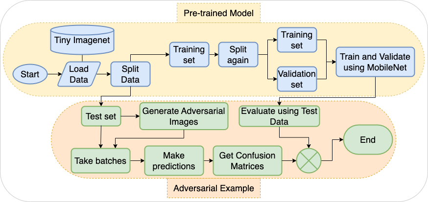

# Com_Architect
Computer Architecture Project
## This code first import libraries, load data from Tiny Imagenet and split the training data set into training and validation sice the test set does not contain test labels. Hence, we used validaiotn set as the test set. We have used mobilenet pre trained model here. The code then trains the model using trianing and validation sets and prints CPU usage, execution time and Memory usage for each model. Then we eveluated the model using test set. Finally, adversarial images are generated using each model for all test images. The adversarial confusion matrices and orginal image confusion matrices are illustrated once the the CPU usage, evaluating time and memory usage for evaluation is printed. 

